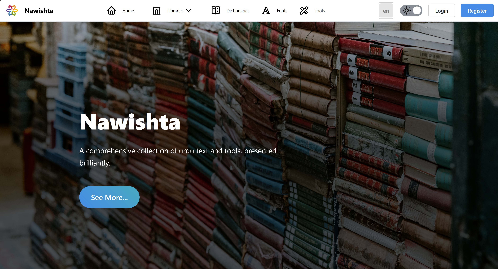
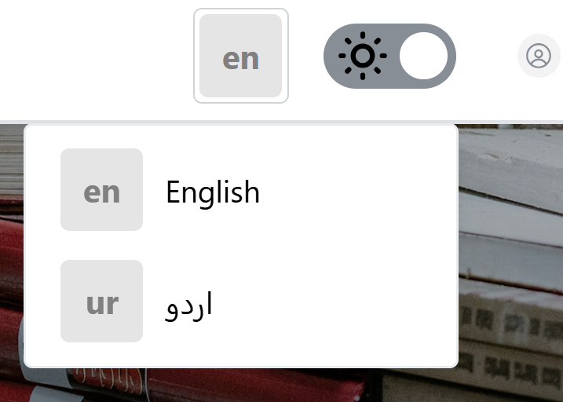
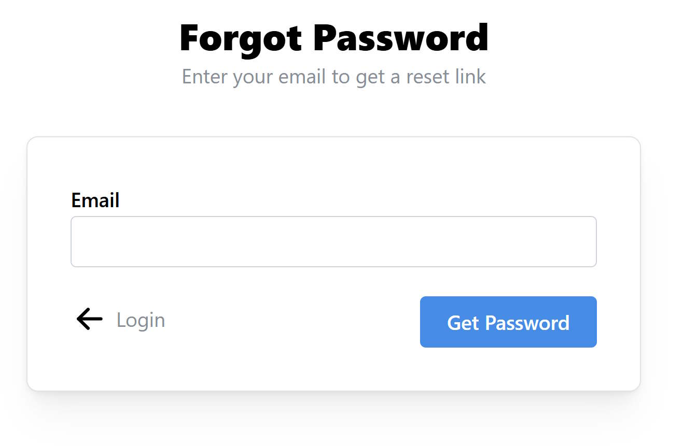

# Getting Started with Nawistha Web Application

## Overview

Nawistha is a comprehensive digital library platform designed to provide seamless access to books, manuscripts, and educational resources. This user guide will walk you through every aspect of using the web application effectively.

## Accessing the Application

### System Requirements
- **Browser**: Chrome (recommended), Firefox, Safari, or Edge
- **Internet Connection**: Stable broadband connection
- **Screen Resolution**: Minimum 1024x768 (1920x1080 recommended)
- **JavaScript**: Must be enabled

### First Visit

1. **Open your web browser** and navigate to the Nawistha website
2. **Wait for the page to load completely** - you'll see the Nawistha logo and navigation bar
3. **Observe the landing page layout** which includes:
   - Header with navigation menu
   - Featured content area
   - Footer with additional links

## Understanding the Interface

### Navigation Bar Components

The top navigation bar is your primary tool for moving around the application:

#### Primary Navigation Menu
- **[Home](./home.md)** - Main dashboard with featured content and recent updates
- **[Libraries](./libraries.md)** - Browse and access digital library collections
- **[Dictionaries](./dictionaries.md)** - Language reference tools (currently in development)
- **[Fonts](./fonts.md)** - Typography options for enhanced reading experience
- **[Tools](./tools.md)** - Additional utilities and features

#### Secondary Navigation Elements
- **Search Bar** - Located in the header for quick content discovery
- **User Menu** - Profile access and account settings (when logged in)
- **Language Selector** - Switch between interface languages
- **Theme Toggle** - Switch between light and dark modes

### Footer Navigation
- **About Links** - Information about the platform
- **Help Documentation** - Access to support resources
- **Contact Information** - Ways to reach support team
- **Legal Information** - Terms of service and privacy policy

## Customizing Your Experience

### Language Preferences

Nawistha supports multiple interface languages for global accessibility:

**Step-by-Step Language Change:**
1. **Locate the language selector** in the top-right corner of the header
2. **Click on the current language** (displays as language code, e.g., "EN" for English)
3. **Select your preferred language** from the dropdown menu
4. **Wait for the page to refresh** with the new language interface
5. **Verify the change** by checking that menu items are now in your selected language

**Important Notes:**
- Language change affects only the user interface elements
- Book content and metadata remain in their original language
- Your language preference is saved in browser cookies
- Some languages may have partial translations
- Language selection is saved locally and is not synced to server.

### Display Mode Configuration

Optimize your reading environment with theme options:

**Switching to Dark Mode:**
1. **Find the theme toggle** next to the language selector (moon/sun icon)
2. **Click the toggle button** once
3. **Observe the interface change** to dark theme with:
   - Dark background colors
   - Light text for better contrast
   - Reduced eye strain in low-light conditions

**Switching to Light Mode:**
1. **Click the theme toggle** again (now showing sun icon)
2. **Interface returns to light theme** with:
   - Light background colors
   - Dark text for optimal readability
   - Better for well-lit environments

**Theme Persistence:**
- Your theme preference is automatically saved
- Setting applies across all pages during your session
- Preference is remembered on return visits on same device and would not be synced between different devices and browsers.

## Account Management

### Creating a New Account

To access all features of Nawistha, you'll need to create a user account:

**Registration Process:**
1. **Navigate to the registration page**
   - Click the **"Register"** button in the top-right corner of the header
   - You'll be redirected to the registration form

2. **Complete the registration form**
   - **Full Name**: Enter your complete name (first and last name). This name is for display and would not be used as login.
   - **Email Address**: Provide a valid email address (this will be your username)
   - **Password**: Create a strong password with:
     - Minimum 8 characters
     - At least one uppercase letter
     - At least one lowercase letter
     - At least one number
     - Special characters recommended
   - **Confirm Password**: Re-enter your password to ensure accuracy

3. **Accept terms and conditions**
   - Read the terms of service carefully
   - Check the agreement checkbox
   - Optionally subscribe to newsletters

4. **Submit registration**
   - Click the **"Create Account"** button
   - Wait for the confirmation message

5. **Email verification (if required)**
   - Check your email inbox for a verification message
   - Click the verification link in the email
   - Return to the website and log in

**Registration Troubleshooting:**
- If email already exists, use the login page instead
- For password errors, ensure all requirements are met
- Contact support if verification email doesn't arrive within 10 minutes

### Logging Into Your Account

**For Existing Users:**
1. **Access the login page**
   - Click **"Login"** in the header
   - Or visit the login URL directly

2. **Enter your credentials**
   - **Email**: Type the email address used during registration
   - **Password**: Enter your account password carefully

3. **Optional settings**
   - **"Remember me"**: Check this box to stay logged in for 30 days
   - Only use on personal devices for security

4. **Complete login**
   - Click the **"Login"** button
   - Wait for redirect to the dashboard

**Login Success Indicators:**
- Redirect to the home page
- Your name appears in the top-right corner
- "Login" button changes to profile menu
- Access to restricted content becomes available

### Password Recovery and Reset

**If You've Forgotten Your Password:**
1. **Navigate to password reset**
   - On the login page, click **"Forgot Password?"**
   - You'll be taken to the password recovery form

2. **Request password reset**
   - Enter your registered email address
   - Complete any security verification (if required)
   - Click **"Send Reset Instructions"**

3. **Check your email**
   - Look for an email with the subject "Password Reset Request"
   - Check spam/junk folders if not found in inbox
   - Email will arrive within 5-10 minutes

4. **Reset your password**
   - Click the reset link in the email (valid for 24 hours)
   - Enter your new password twice
   - Ensure new password meets security requirements
   - Click **"Update Password"**

5. **Confirm reset success**
   - You'll see a confirmation message
   - Log in immediately with your new password

**Password Reset Security:**
- Reset links expire after 24 hours
- Only one reset request is active at a time
- New requests invalidate previous reset links

### Changing Your Password (When Logged In)

**For Security Updates:**
1. **Access account settings**
   - Click your profile name in the top-right corner
   - Select **"Account Settings"** or **"Profile"** from the dropdown menu

2. **Navigate to password section**
   - Look for **"Change Password"** or **"Security"** tab
   - Click to expand the password change form

3. **Update password**
   - **Current Password**: Enter your existing password
   - **New Password**: Create a new secure password
   - **Confirm New Password**: Re-enter the new password
   - Click **"Update Password"**

4. **Verify change**
   - You'll receive a confirmation message
   - Consider logging out and back in to test the new password

**Password Security Best Practices:**
- Change passwords every 3-6 months
- Use unique passwords for different websites
- Consider using a password manager
- Never share your password with others
- Log out from shared or public computers

## Getting Help and Support

### Built-in Help Resources
- **Tooltips**: Hover over interface elements for quick explanations
- **User Guide**: Access this comprehensive guide from the Help menu

### Contact Support
- **Email**: support@nawistha.com

### Troubleshooting Common Issues

**Login Problems:**
- Clear browser cache and cookies
- Disable browser extensions temporarily
- Try incognito/private browsing mode
- Ensure JavaScript is enabled

**Loading Issues:**
- Check internet connection stability
- Refresh the page (F5 or Ctrl+R)
- Try a different browser
- Contact support if problems persist

**Content Not Displaying:**
- Verify you have necessary permissions
- Check if content is still available
- Report broken links to support

## Next Steps

After completing this getting started guide, you're ready to:

1. **Explore Libraries** - Browse available book collections
2. **Set Up Reading Preferences** - Customize fonts and display options
3. **Join Communities** - Connect with other readers and scholars
4. **Access Advanced Features** - Discover research tools and annotations

**Recommended First Actions:**
- Complete your profile information
- Browse featured collections
- Bookmark interesting content
- Set up notification preferences
- Explore mobile accessibility options

Welcome to Nawistha! We hope you have an excellent experience exploring our digital library platform.
