# Libraries page.

Libraries page is similar to home page but it shows the list of libraries at the bottom of the page. Clicking on any library from the header menu or the list below, will take user to the library page.

# Library Page

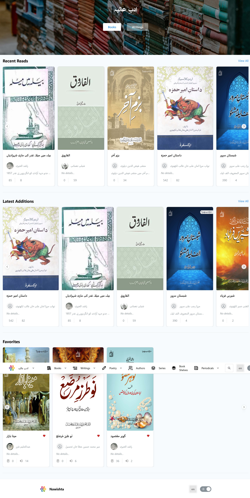

This page shows a summary of the library. Header shows the different navigation options to books, writings, poetry, series, authors and periodicals. The contents of header can be different based on features a library supports.

The page contents shows list of different books:

### Recent Books

This is the list of books which user has been reading. User can use this list to quickly jump to a book that they are reading

### Latest Editions

This is the list of book added to the library recently.

### Favourites

These are the books user has marked as their favourites.

All these lists can contain up to 12 items and user can use navigation buttons or touch to scroll left or right to discover other books.

If there are more books to be seen in each section, “**View All…”** link is shown which takes user to a list page of books where they can use paginated list of books and search through them.

Once in the library section, library name appears on the top left corner with icon of the site. Clicking it would open a menu that can be used to quickly navigate between libraries or jump to the library editor page for this library.

Book in header is a menu and user can choose to view books based on the categories.  Clicking on “**All Books”** link will show all books in the library.

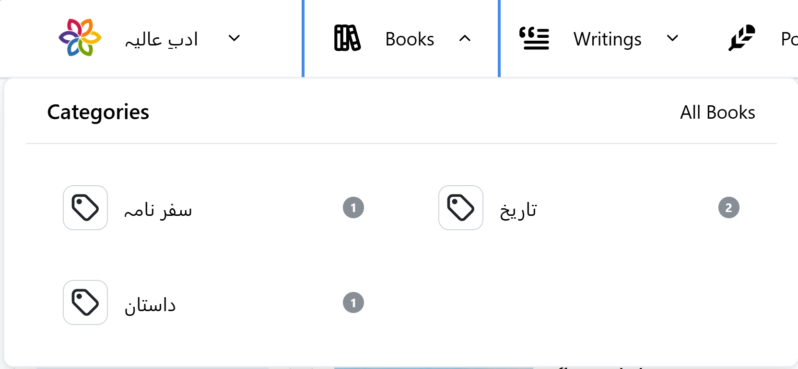

Writings in header is also a menu and allows user to view the writings belonging to the selected category. User can view all writings by clicking on “**All Writings**”  link.

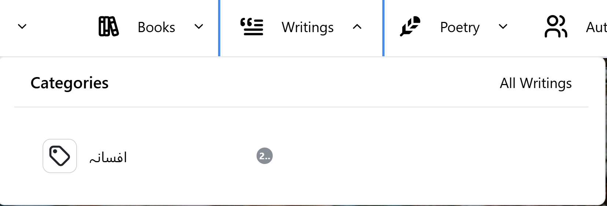

Poetry menu also performs similar actions but for the poetic writings. User can choose any category or can view all poetries by clicking on “**View All**” link.

## Books page

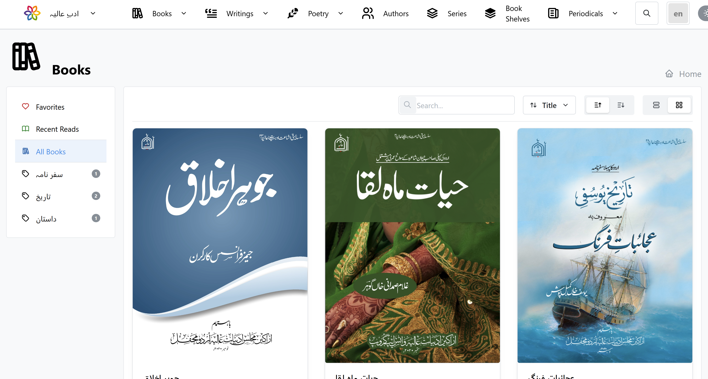

Book page provides a way to browse through the books catalogue. I have controls to customize view and filter and sort the books. It also allows user to search for books.

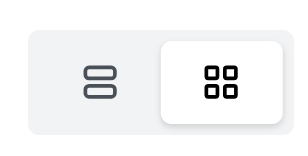

The view button toggles between large preview and details view as show below

Large preview view look like below. It provide with better preview of book title.

List view shows small images but allows user to see more details

Sort field and sort direct toggle can be used to select which field you want to sort on and what is the direction of sorting, ascending or descending.

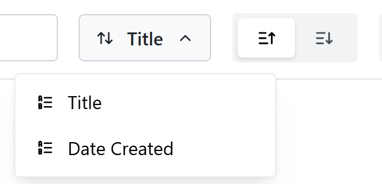

Searching is possible by typing the title match in the search box and pressing enter. Use the “X” icon to clear search.

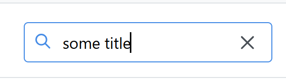

Sidebar can be used to filter books further. There are two section. In top section, user can view the favourites and recently read books. This has same as the list shown in library home page.

On the section below, user can view the list of categories and would be able to select a category for which he want to view the books. These categories show the number of books present in the category. If user prefers to view books from all categories, it can chose the “**All Books**” option

## Book Page

Clicking on a book title or book image on the Books page takes user to book page. This page shows information about this book in details. It  includes the name, author or authors, categories, favourite and book description on the top section.

Side bar contains the book title image as well as some more details about the book. This detail includes, year published, language of book, copyrights, if book is public or private and number of page.

The middle section contains the list of chapter or this book. User can click on the chapter to start reading the book from the chapter.

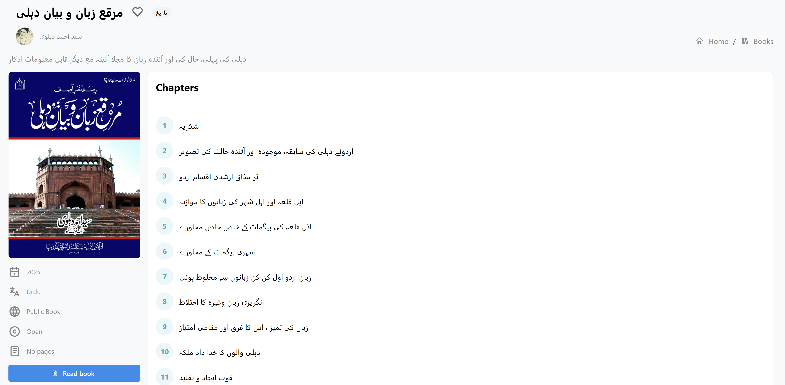

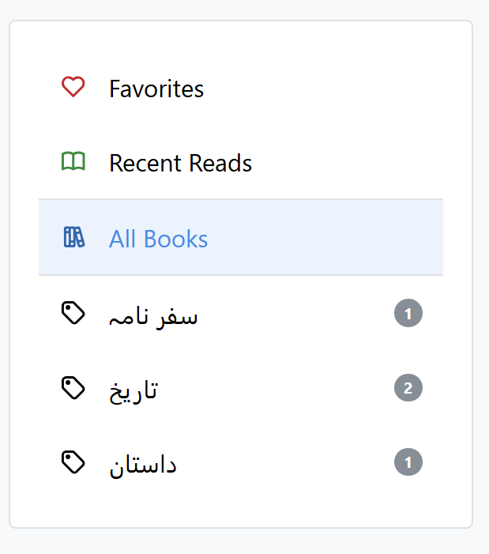

If the heart icon is not filled, it means that the book is not added to your favourites. Clicking this heart will add it to favourites. That should show it filled after the change is saved. Clicking on a favourite book’s icon will remove the book from favourites.

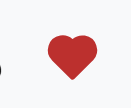

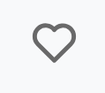

Clicking on category will take user to books list for the category. Similarly clicking on the author name or image will take user to authors page.

Clicking on the Read book button on bottom will take user to the first page of first chapter to read.

## Book Reader

There are various types of readers in the application. Mainly there are text reader which renders the text and allow user to modify the text appearance. It looks like below

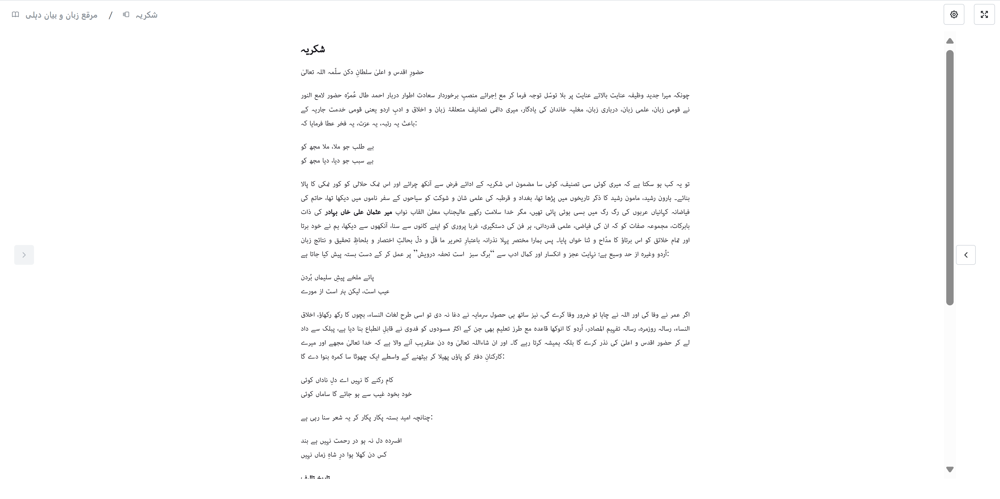

The header has links to book page, chapter selection to the left. On the right, there are controls to modify the reader options and toggle between full screen and normal view.

First item in the toolbar is the book name. This is the link to the book page. If user clicks on it, they will be taken to the book page.

Second item is the chapter selector. It displays the currently selected chapter name. Clicking it would open a side panel that shows basic book information and chapter selection. User can click on any chapter to jump directly to the chapter

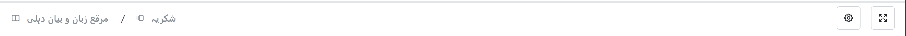

Next in the toolbar is the settings button. This button will open a slider with view options:

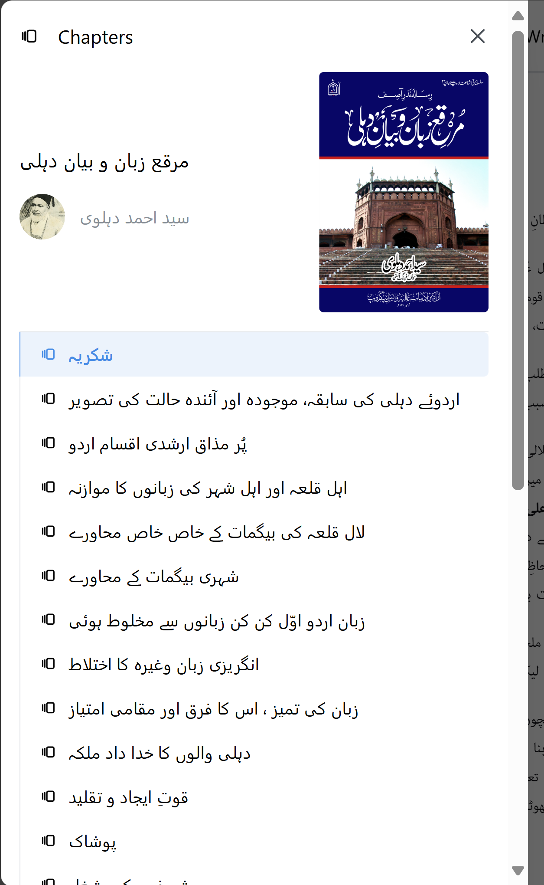

### View

There are currently three views supported.

1. Scroll View
2. Single page view
3. Double page view

**Scroll view**

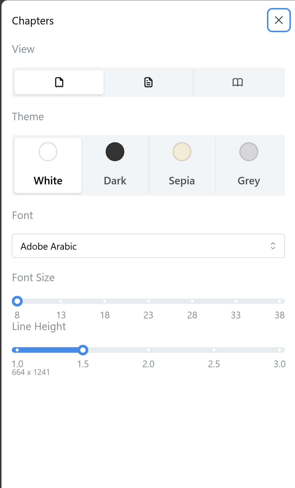

This view renders text of the book in vertical scrollable view. It is similar to any website where you can scroll text vertically. It is the default view used by the website.

**Single page view**

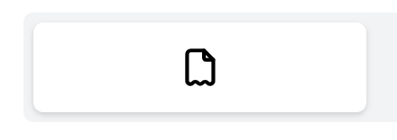

This view shows one page of the book at a time. The view has a page borders and navigation controls shown on left and right which will scroll the book accordingly. The page scroll direction depends on the language set on book. Pressing next after last page of chapter will take to the next chapter automatically.

On narrow screens the navigation buttons will be hidden to use more space for displaying text. User can use scroll left and right swipe on touch screen devices to navigate between pages.

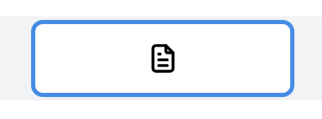

**Double Page View**

As the name suggests, this view shows two pages at the same time. This view is only available on wide screen devices and narrow screens it will revert to single page view automatically. All user navigation and operations are similar to the single page view.

### Theme

User can chose between four themes to chose from. These themes will change the way book content are rendered.

### Font settings

User can customise the font, font size and space between the lines to adjust according to their liking.

All these settings are saved for user computer and will be used for any book reading session for the same book or another.

## Writings

This section contains collection of prose. It is similar to books page with all controls to control the writings user want to see.  User can switch between list and item view, apply sorting and search for writings from similar controls. Side bars provides more filters.

## Writing Page

Clicking on the writing takes user to writing page. This is a reader view which is similar to book reader view, with all controls and features. There is only vertical scroll view available to user. In addition to that author is also shown in the header.

## Poetries

This section contains collection of poetries. It is similar to books or writings page with all controls to control the poetries user want to see.  User can switch between list and item view, apply sorting and search for poetries from similar controls. Side bars provides more filters.

## Poetry Page

Clicking on the writing takes user to poetry reading page. This is a reader view which is similar to book reader view, with all controls and features. Similar to writing reader view there are not view modes available.

## Authors

This section contains collection of authors. It is similar to books page with all controls to control the authors user want to see.  User can switch between list and item view, apply sorting and search for authors from similar controls.

Clicking an author takes user to the author page.

## Author Page

This page shows the author details, their books, writings and poetries.

Using the top tab, user can view books, writings or poetries. These views contain searching filtering and sorting available as standard control and can be used to navigate to specific item. Click on any item in this view will take user to the user to items page or reader view based on item type. These details are similar to list pages for each item already in this documentation.

## Series page

 This page displays list of series of book. Series is order or unordered collection of book joined together by some properties of book.

Clicking on the item will take user to the series page where all book from the series will be displayed. User can click on book to navigate to the book page.

View offers few more sorting options to allow user to navigate to books they require.

## Book Shelf

Book shelf is a way to organize books in library. Book shelves can be public or private for a user. Public book shelves can be viewed by other users of library where as the private book shelves can only be seen by the owner. Only owner can add or remove books from the book shelf of any kind.

Use the Add button on the top of the book shelf to create a new book shelf.

Provide the name of book shelf, some description and set if it is public book shelf

Once a book shelf is created it will appear in the list view. User can click on the book shelf and view the books in the shelf. More books can be added or existing books can be removed from the book shelf. Any book can be viewed and read by click on the book .

> This is under development
>

## Periodical page

Periodicals are the publication published on certain interval containing some articles. Each periodical have a frequency of publication e.g. Yearly, Quarterly, Monthly, Bi-monthly and weekly. Each periodical have volume and issue number to identify as well as publication date.

This page shows the periodicals that are available to the library.

User can chose to filter, sort and search for periodical. Sidebar gives more specific periodicals views based on frequency of publishing or category.

## Periodical Page

User can see the periodical details and issues for periodical by clicking on it. This opens the periodical page.

Page shows basic information about periodical on the top bar. Main content of the page shows the issues available for this periodical. User can use sidebar to view the periodicals for certain year or month depending on frequency. Usual sorting and filtering options are also available in the UI. Each issue contain articles. The number of articles in the issue are also given on the each item.

## Issue Page

User can click on the title to navigate to the issue page where the details of the issue can be seen. The main content of the page is the Issue articles. User can click on any article and open reader view to read the article.

> This feature is under development
>
